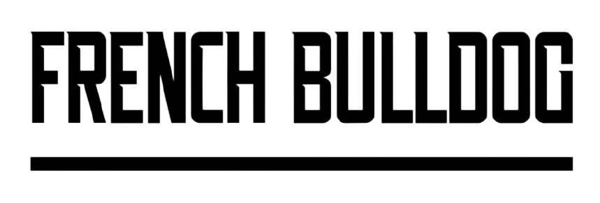

# FIFI (French Bulldog Meetup)

*FIFI* is a site dedicated to French Bulldog related questions and a community in the dublin area for meetups.

The French Bulldog Dubin Club has been around for over 10 Years !! 

However , only recently has the club gone to social media to grow its following and recruit some new memebers.

Users of this site who are interested in joining one of the meetups can do so by completing the sign-up form in the contact section.

You can view the [live website](https://hluke93.github.io/ms1/).

## Table of Contents

1. [Site Design ](#site-design)
2.  [Wireframes](#wireframes)
    * [Homepage](#homepage)
3. [Features](#features)
    * [Initial Deployment Features](#initial-deployment-features)
    * [Future Features](#future-features)
4. [Technologies Used](#technologies-used)
5. [Testing](#testing)
6. [Deployment](#deployment)
7. [Credits](#credits)

# Site Design

* The approach I took designing this website was to display clear , concise text so the user could retain information.
* To do this I added 5 questions and answers on the homepage , some images , a video and a meetup location map.
* I chose 2 fonts when designing this site , Open+Sans and Monserrat , both take from Googlefonts.
* The color scheme I went with during the design was rgb(66, 66, 66) for the Nav Bar and Footer with   color: #fff for the links.
  I also used a #00adb5 color for borders and active links.
* The Default font color was #000000 , However this was amended to rgb(66, 66, 66) to add more consistancy to the site.

## Wireframes

### Desktop Pages

### Mobile Pages

# Features

* **Main Logo**

Located at the Top of the page , The French Bulldog Logo printed in black and white.
THe Logo also acts as a clickable link which will direct the user back to the homepage.

* **Social Icons & Links**

To the left of the Main Logo is 3 Social Links. Tik Tok , Instagram and Facebook.
All 3 Links open in a new tab to the sites.
The Instagram link , links directly the the Dublin French Bulldog Page.

* **Main Navigation Menu**

The Main Navigation consists of a navigation bar with 3 links. Home , Gallery and Contact.
Each link will direct the user to a new page.
The current active page link is highlighted in the navbar. When the user hovers of a 
different link , the link is highlighted also.

* **Main Section**

The Main Section answers one of the most commonly asked questions in relation to French Bulldogs.

*Why have French Bulldogs become so popular?

Alongside this questions is an image of a French Bulldog with a Big Smile on his face!

* **Mid Section**

The Mid Section aims to answer 4 French Bulldog Related Questions.

1. Why have French Bulldogs become so popular?
2. Should I buy a French Bulldog?
3. Are french bulldogs lazy?
4. Are french bulldogs easy to train?

There is also a center image of a French Bulldog.

* **Meetup Information**

This Section of the page invites to user to view a video of a previous French Bulldog Meetup.
The video gives the user a sample of what goes on at the meetups.
There is a link to sign up for the next french bulldog meetup which takes the user to the contact page of ths site.
The location of the meetup is displayed and a google map location iframe.

 

* **Footer**

The Footer is located at the bottom of the page and displays the text ''Copyright 2021 Fifi the Frenchie''. This is not a legitimate copyright name , it is used for display purposes only.

There are 4 links in the footer , Contact, Donate, Help and FAQ , Privacy Policy.
All 4 of these links take the user back to the homepage.

* **Gallery**

The Gallery page has a selection of 9 French Bulldog images.
The purpose of this page is to show the user the many different colors and types of French Bulldogs , and to also give insight
into the type of companion Frenchies are.

 

* **Contact**

The Contact link give the user the oppertunity to sign-up to become part of the French Bulldog meetup.
The Contact for has 4 fields to be completed by the user.
1. First Name
2. Last Name
3. Email Address
4. Frenchies name

 

## Technologies Used

* [HTML5](https://en.wikipedia.org/wiki/HTML5) was used for the HTML site markup
* [CSS3](https://en.wikipedia.org/wiki/CSS#CSS_3) was used to style the HTML content
* [Balsamiq](https://balsamiq.com/) was used to create the wireframes
* [Am I Responsive](http://ami.responsivedesign.is/) was used to test the responsiveness of the site
* [Pexels](https://www.pexels.com/) was used to download copyright free images
* [Font Awesome](https://fontawesome.com/) was used for the site icons / social icons
* [Google Fonts](https://fonts.google.com/) provided the fonts used on the site
* [Google Chrome Developer tools](https://developer.chrome.com/docs/devtools/) was used to test site responsiveness and to test code
* [Github](https://github.com/HLuke93) was used as the repository hosting service
* [Gitpod](https://www.gitpod.io/) was used as the Code Editor for the site
* [Animate](https://animate.style/) was used for the animation
* [W3C Markup](https://validator.w3.org/) and [Jigsaw validation](https://jigsaw.w3.org/) were used to validate the HTML and CSS used.

## Testing

* Testing was performed on Google Chrome and MIcrosoft Edge.
* Media Queries were added to ensure that the site is responsive across all device sizes.
* Testing was perfromed on the contact page form to ensure all fields are required.
* All links on the site have been tested to ensure they are working.
* All external links to pages were tested to ensure a new tab is opened once clicked.

## Bugs

* When the webpage is opened on Mozilla Firefox, there is a layout issue with the HR (Horizontal Rule) 
  It looks different than on Chrome and Edge.
* This Bug is still outstanding.

## Validator Testing

* HTML
No Errors found when testing through the official W3C validator.
1 warning message (See below)
 

* CSS
No Errors found when testing through the official Jigsaw validator.

 

* Accessibility

Webpage was run through Lighthouse in Chrome Devtools to test acessibility

 

## Deployment

The site was deployed to GitHub pages. 

The steps to deploy are as follows:
* In the GitHub repository, navigate to the Settings tab
* Select the Pages sub-menu
* From the source section drop-down menu, select the Master Branch, and then hit save
* Once the master branch has been selected, the page will be automatically refreshed with a detailed ribbon display to indicate the successful deployment.

The live link can be found here - (https://hluke93.github.io/ms1/)

## Credits

* Content 

The Code used in this website was written from scratch.
The Code institute , Youtube and W3 Schools was referenced.

* Media

The Images used on this webpage were taken from [Pexels](https://www.pexels.com/)
The Animation for the Navbar and Social links was take from [Animate](https://animate.style/)

