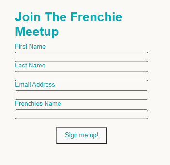

# FIFI (French Bulldog Meetup)

*FIFI* is a site dedicated to French Bulldog related questions and a community in the dublin area for meetups.

The French Bulldog Dubin Club has been around for over 10 Years !! 

However , only recently has the club gone to social media to grow its following and recruit some new memebers.

Users of this site who are interested in joining one of the meetups can do so by completing the sign-up form in the contact section.

You can view the [Live Website Here](https://hluke93.github.io/ms1/).

## Table of Contents

1. [Site Design ](#site-design)
2. [Wireframes](#wireframes)
3. [Features](#features)
4. [Technologies Used](#technologies-used)
5. [Testing](#testing)
6. [Deployment](#deployment)
7. [Credits](#credits)

# Site Design

* The approach I took designing this website was to display clear , concise text so the user could retain information.
* To do this I added 5 questions and answers on the homepage , some images , a video and a meetup location map.
* I chose 2 fonts when designing this site , Open+Sans and Monserrat , both taken from [Google Fonts](https://fonts.google.com/).
* The color scheme I went with during the design was rgb(66, 66, 66)  for the Nav Bar and Footer with color: #fff (White) for the links.
  I also used a #00adb5  color for borders and active links.
* The Default font color was #000000 , However this was amended to rgb(66, 66, 66)  to add more consistancy to the site.
* A Background Color of ##FAF9F6 was added.

## Wireframes

### Desktop Pages

### Mobile Pages

 

* Please note.... Contact Page was changed after wireframes were created. 
* The Cotact Page Layout and Items are not as per Original Wireframe.

 

# Features

* **Main Logo**

Located at the Top of the page, The French Bulldog Logo printed in black and white.
The Logo also acts as a clickable link which will direct the user back to the homepage.

* **Social Icons & Links**

To the left of the Main Logo is 3 Social Links. Tik Tok , Instagram and Facebook.
All 3 Links open in a new tab to the sites.
The Instagram link , links directly to the Dublin French Bulldog Instagram Page.

* **Main Navigation Menu**

The Main Navigation consists of a navigation bar with 3 links. Home , Gallery and Contact.
Each link will direct the user to a new page.
The current active page link is highlighted in the navbar. When the user hovers of a 
different link , the link is highlighted also.

* **Main Section**

The Main Section answers one of the most commonly asked questions in relation to French Bulldogs.

*Why have French Bulldogs become so popular?

Alongside this questions is an image of a French Bulldog with a Big Smile on his face!

* **Mid Section**

The Mid Section aims to answer 4 French Bulldog Related Questions.

1. Why have French Bulldogs become so popular?
2. Should I buy a French Bulldog?
3. Are french bulldogs lazy?
4. Are french bulldogs easy to train?

There is also a center image of a French Bulldog.

* **Footer**

The Footer is located at the bottom of the page and displays the text ''Copyright 2021 Fifi the Frenchie''. This is not a legitimate copyright name , it is used for display purposes only.

There are 4 links in the footer , Contact, Donate, Help and FAQ , Privacy Policy.
All 4 of these links take the user back to the homepage.

* **Gallery**

The Gallery page has a selection of 9 French Bulldog images.
The purpose of this page is to show the user the many different colors and types of French Bulldogs , and to also give insight
into the type of companion Frenchies are.

 

* **Contact**

The Contact link give the user the oppertunity to sign-up to become part of the French Bulldog meetup.
The Contact for has 4 fields to be completed by the user.
1. First Name
2. Last Name
3. Email Address
4. Frenchies name

 

* **Our Locations**

This Section of the page provides the user with contact information for the Dublin and Galway Clubs. 

It gives a contact number and an email contact. 
The location of the meetup Maps are displayed on a google map location iframe. 

 

## Technologies Used

* [HTML5](https://en.wikipedia.org/wiki/HTML5) was used for the HTML site markup
* [CSS3](https://en.wikipedia.org/wiki/CSS#CSS_3) was used to style the HTML content
* [Balsamiq](https://balsamiq.com/) was used to create the wireframes
* [Am I Responsive](http://ami.responsivedesign.is/) was used to test the responsiveness of the site
* [Pexels](https://www.pexels.com/) was used to download copyright free images
* [Font Awesome](https://fontawesome.com/) was used for the site icons / social icons
* [Google Fonts](https://fonts.google.com/) provided the fonts used on the site
* [Google Chrome Developer tools](https://developer.chrome.com/docs/devtools/) was used to test site responsiveness and to test code
* [Github](https://github.com/HLuke93) was used as the repository hosting service
* [Gitpod](https://www.gitpod.io/) was used as the Code Editor for the site
* [Animate](https://animate.style/) was used for the animation
* [W3C Markup](https://validator.w3.org/) and [Jigsaw validation](https://jigsaw.w3.org/) were used to validate the HTML and CSS used.

## Testing

## **Testing was performed on Google Chrome and Microsoft Edge**

* **Main Logo**

The Main Logo was tested for:

1. Responsiveness across all device sizes.
2. The Logo acts as a link to index.html.

**All Tests Passed**

* **Social Icons & Links**

The Social Icons were tested for:

1. Responsiveness across all device sizes.
2. Clicking on the icon opens a new tab and takes the user the the homepage of the social network.
3. Animation on the social icons when the webpage is loaded up.
4. When the user hovers over an icon , the border bottom in activated.

**All Tests Passed**

* **Main Navigation Menu**

The Main Navigation was tested for:

1. Responsiveness across all device sizes
2. Clicking on a link will take the user to that section of the webpage.
3. Animation on the social icons when the webpage is loaded up.
4. The Active/Current page ''a tag'' has a background color.
5. When the user hovers over an icon , the a link background color changes.

**All Tests Passed**

* **Main Section**

The Main Section was tested for:

1. Responsiveness across all device sizes.

**All Tests Passed**

* **Mid Section**

The Mid Section was tested for:

1. Responsiveness across all device sizes.

**All Tests Passed**

* **Footer**

The footer was tested for:

1. Responsiveness across all device sizes.
2. The Links in the footer return the user to the top of the current page.
3. When the user hovers over an link , the border bottom in activated and the font color changes also.

**All Tests Passed**

* **Gallery**

The Gallery page was tested for:

1. Responsiveness across all device sizes.
2. Column count changes from 3 to 2 when the device width reaches 1000px.

**All Tests Passed**

* **Contact/Sign-Up Form**

The Form was tested for:

1. Responsiveness across all device sizes.
2. The Form must be completed to Submit.
3. Require message displays if a user sumbits an empty fields.
4. If no @ symbol entered in the email address field, an error will display to prompt the user to input an correct email format.

**All Tests Passed**

* **Meetup Information**

The Meetup information section was tested for:

1. Responsiveness across all device sizes.
2. Embedded video can be played.
3. The Map Iframe displays correctly.
4. The Link to sign-up takes the user to the top of the contact page.

## Bugs

* When the webpage is opened on Mozilla Firefox, there is a layout issue with the HR (Horizontal Rule) 
  It looks different than on Chrome and Edge.
* This Bug is still outstanding.

## Validator Testing

* HTML
No Errors found when testing through the official W3C validator.
1 warning message (See below)

* CSS
No Errors found when testing through the official Jigsaw validator.

 

* Accessibility

Webpage was run through Lighthouse in Chrome Devtools to test acessibility

 

## Deployment

The site was deployed to GitHub pages. 

The steps to deploy are as follows:
* In the GitHub repository, navigate to the Settings tab
* Select the Pages sub-menu
* From the source section drop-down menu, select the Master Branch, and then hit save
* Once the master branch has been selected, the page will be automatically refreshed with a detailed ribbon display to indicate the successful deployment.

The live link can be found here - (https://hluke93.github.io/ms1/)

## Credits

* **Content** 

The Code used in this website was written by the developer.
The Code institute , Youtube and W3 Schools were used a guides.

* **Media**

The Images used on this webpage were taken from [Pexels](https://www.pexels.com/)
 
The Animation for the Navbar and Social links was take from [Animate](https://animate.style/)
 
The Main Logo was created using [Looka](https://looka.com/logo-maker/)

